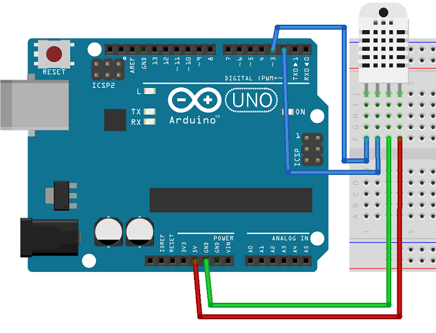
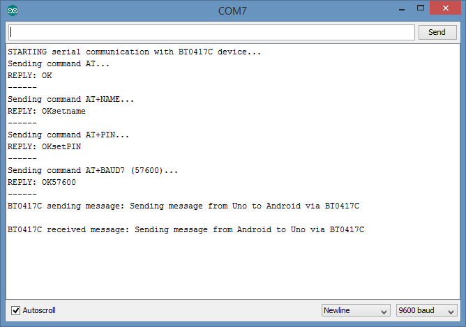
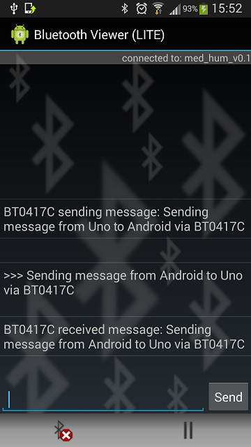

BT0417C Configuration
==============

This document describes how to configure the BT0417C module. Once configured, it may be used in other projects.

# What is the BT0417C?

The BT0417C is a Wireless Bluetooth TTL Transceiver Module on one end and RS232 communication at the other. That means you can use it to add Bluetooth to any RS232 enabled device such as a microcontroller. 
At the heart of this breakout board, manufactured by mdfly.com is the CSR BC417 chip, once manufactured by CSR (Cambridge Silicon Radio Limited now Qualcomm).

# Configuration

Configuring the BT0417C is done in four steps

1. Wiring the UNO to the BT0417C
2. Editing parameters in the sketch
3. Uploading the sketch and checking Serial Monitor
4. Finding and changing the factory set Baud Rate

## Wiring



Wire ground (green) and +5V (red) from your breadboard to the UNO (the actual labels are written at the back of the BT0417C), then TX to Pin 2 and RX to Pin 3.  
Once the module is powered up via the UNO, a blinking LED on the BT0417C indicates that bluetooth radio is functional and device is not paired. When it is paired, the LED will stay on and stop blinking.

## Editing parameters in the sketch

Once you open the sketch, the parameters we need to look out for are Name, PIN and Baud Rate. Then change them to suit your application.

### Name

This is the name your BT0417C will show when paired with another device. In setup(), look for the line

```   
mySerial.write("AT+NAMEmed_hum_v0.1"); 
```

and edit the name, in this case **med_hum_v0.1**.

### PIN

This is the PIN your BT0417C will require to pair with another device. In setup(), look for the line

``` 
  mySerial.write("AT+PIN0123"); 
```

and edit the PIN, in this case **0123**.

### Baud Rate

This is the baud rate your BT0417C device will use to commmunicate with other devices. In setup(), look for the line

``` 
  mySerial.write("AT+BAUD7");
```

and make a note of the baud rate code number, in this case **7**, which corresponds to baud rate 57600. For a full list see the [AT Command Set] (http://mdfly.net/Download/Wireless/BT0417C_ATcommand.pdf).

**Do not change the baud rate code number for the time being**.

## Uploading the sketch and checking Serial Monitor

Upload the sketch, open a Serial Monitor and you might see the message:

``` 
STARTING serial communication with BT0417C device...
Sending command AT...
REPLY: OK
------
Sending command AT+NAME...
REPLY: OKsetname
------
Sending command AT+PIN...
REPLY: OKsetPIN
------
Sending command AT+BAUD7 (57600)...
REPLY: OK57600
------
```

If you see the reply messages, it means your BT0417C factory set baud rate was indeed 57600. If you get no replies, see the next section.

## Finding and changing the factory set Baud Rate

In **setup()** a baud rate is set for the UNO to communicate with the BT0417C in line

``` 
  mySerial.begin(57600);
```

This must match what is already set in the module, which might not be the case. If the baud rate set for the UNO (in this example 57600) does not match the default factory set baud rate in the BT0417C, there will be no reply from the module showing up in the Serial Monitor. In this case, you have to go through the values, from 1 to 8 (corresponding to 1200 to 115200), always changing the software serial baud rate in 

```
  mySerial.begin(57600);
```

to match baud rate code in 

```
  mySerial.write("AT+BAUD7");
```

Suppose you successfully found the baud rate, by setting baud rate to 9600 in the sketch and code 4 in the module, uploading the sketch, opening a Serial Monitor and getting a reply as "REPLY: OK9600". Now you are in control and can change the baud rate if you need to, remembering that if you do change the baud rate, change the AT command first ("AT+BAUD7"), upload the sketch, then change the software serial baud rate to match the new one set in the BT0417C and upload sketch again to resume communication between UNO and BT0417C.

# Testing

To test communication to and from the BT0417C you will need an Android app such as [Amarino](https://code.google.com/archive/p/amarino/downloads) or [Bluetooth Viewer (LITE)](https://play.google.com/store/apps/details?id=net.bluetoothviewer&hl=en). Once you have the app installed, open a Serial Monitor to send and receive messages.





If your test is successful, the BT0417C is configured and may be added to other projects that require Bluetooth.

# Datasheets

[CSR BC417 datasheet](https://cdn.sparkfun.com/datasheets/Wireless/Bluetooth/CSR-BC417-datasheet.pdf) at SparkFun.  
[Breakout board datasheet] (http://mdfly.net/Download/Wireless/BT0417C_datasheet.pdf) at MDFLY.  
[AT Command Set] (http://mdfly.net/Download/Wireless/BT0417C_ATcommand.pdf) at MDFLY.  

# Pitfalls

The BT0417C, when scanning for other devices, drains current in the order of several hundred mA, peaking at nearly 1A according to my measurements. If you have other devices attached to your UNO, the USB connection might not be able to supply enough power to your prototype. If the prototype runs low on power all hell breaks loose. If you do notice erratic behaviour, power your UNO externally, making sure the power rating of your power supply matches what your prototype requires.